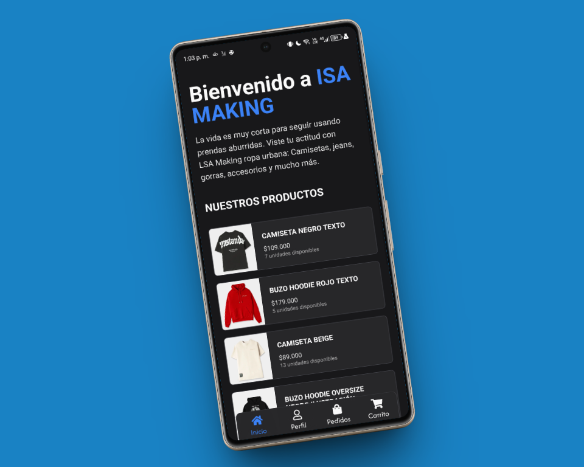
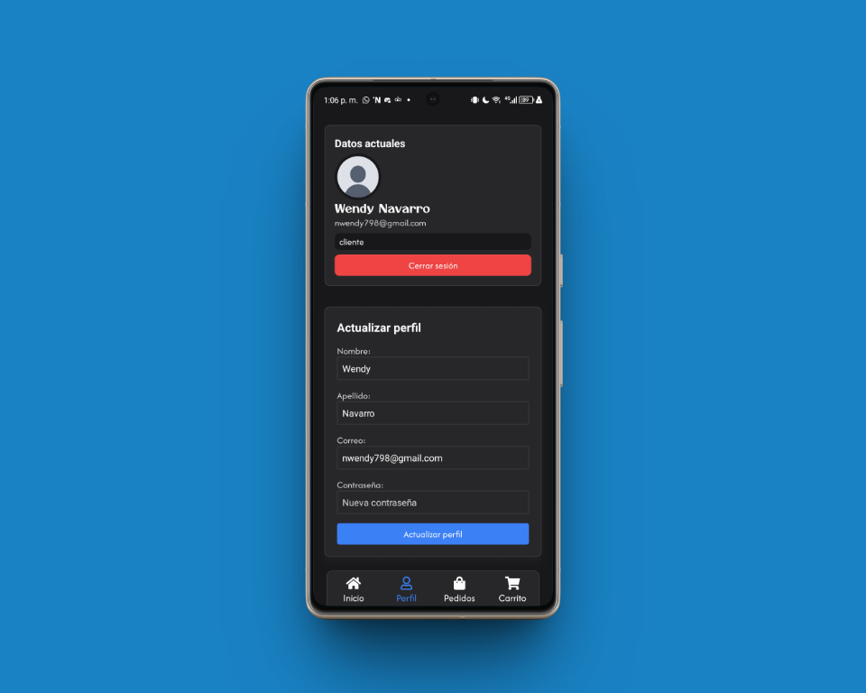
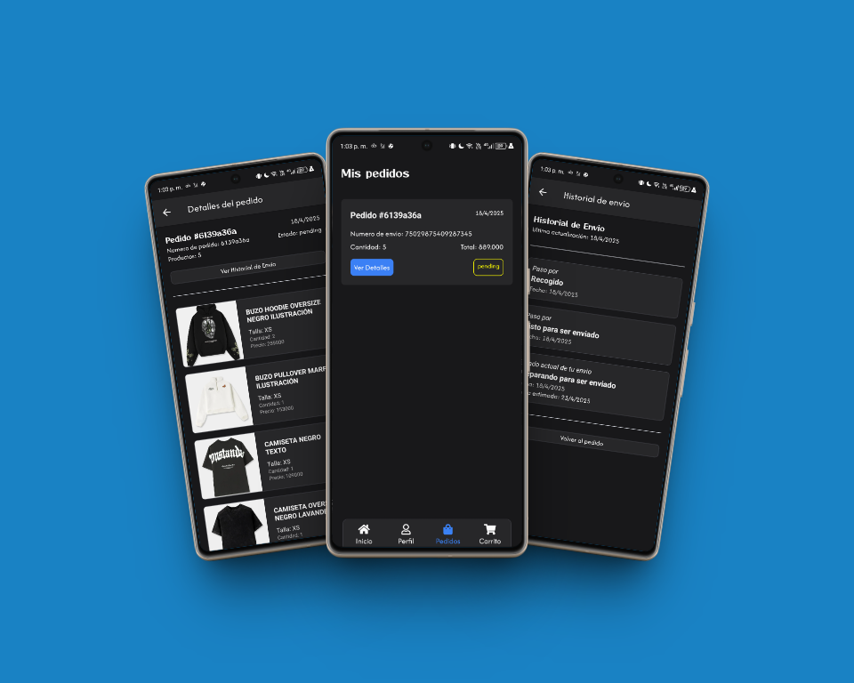
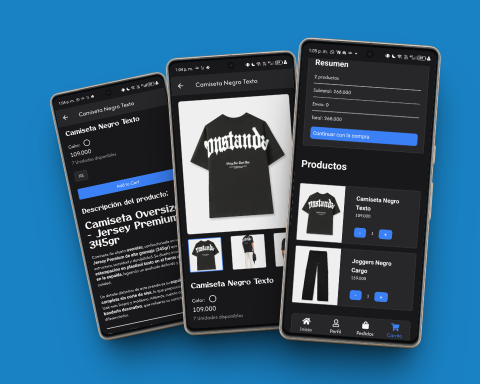
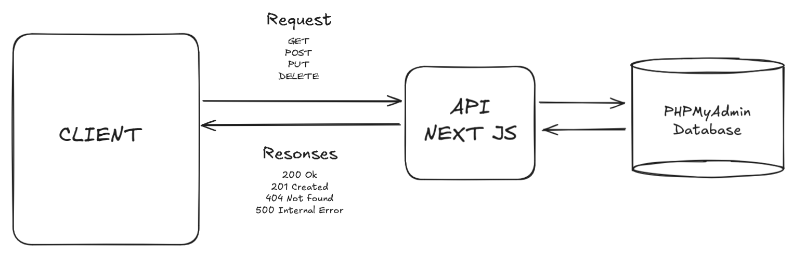

# 🛍️ ISA Making Mobile

[Version en español](README.es.md)

ISA Making is an information system designed to manage the entire e-commerce workflow — from product selection and customization to payment and delivery tracking. It allows users to add products to a cart, complete secure payments, and monitor shipping status via services like Interrapidísimo. Administrators have full control over product management and inventory updates.



---

## 📑 Table of Contents

1. [Key Features](#-key-features)
2. [Tech Stack](#-tech-stack)
3. [System Architecture](#%EF%B8%8F-system-architecture)
4. [System Workflows](#-system-workflows)
5. [Installation](#%EF%B8%8F-installation)
6. [Contact](#-contact)

---

## ✨ Key Features

The system provides the following core functionalities:

---

### 🧥 User Authentication

Secure and seamless user authentication to protect user data and personalize the shopping experience.


---

### 👤 Profile Management

Users can easily manage their profiles, update personal information, and track order history.



---

### 📦 View Order Details

Detailed order tracking and history, allowing users to monitor the status of their purchases from placement to delivery.



---

### 🛒 Product Cart

Intuitive and user-friendly product cart functionality, enabling users to easily add, remove, and manage items before checkout.



---

## 💻 Tech Stack

### **Frontend**

-   **Expo V52**
-   **NativeWind V4**
-   **TailwindCSS V3.14**
-   **Valibot**

### **Backend (NextJS Project)**

-   **Next.js API (App Router)**
-   **Sequelize CLI + MySQL**
-   **PayU Payment Gateway**

---

## 🏗️ System Architecture

ISA Making follows a **client-server architecture**, with a clear separation between frontend and backend layers. Communication occurs via HTTP requests and API endpoints, ensuring scalability, maintainability, and dynamic user experiences.

> **Frontend:** Delivers a responsive, interactive UI  
> **Backend:** Handles business logic, authentication, payments, and database operations



---

## 🔄 System Workflows

This section outlines the key workflows within the ISA Making Mobile system:

-   **Product Browsing:** Users can browse products, filter by categories, and view detailed product information.
-   **Adding to Cart:** Users can add products to their cart and adjust quantities.
-   **Checkout Process:** A secure and streamlined checkout process, including address selection and payment options.
-   **Order Placement:** Submitting orders and receiving confirmation.
-   **Order Tracking:** Monitoring the status of placed orders.
-   **Admin Product Management:** Administrators can add, edit, and remove products from the system.
-   **Inventory Management:** Administrators can update inventory levels.

---

## 🛠️ Installation

Follow these steps to run ISA Making locally:

### **Prerequisites**

-   Node.js >= 18
-   Have running the [NEXT PROJECT](https://github.com/AndresGutierrezHurtado/isa-making)

### **Steps**

1. **Clone the repository**

    ```bash
    git clone https://github.com/AndresGutierrezHurtado/isa-making-mobile.git
    cd isa-making-mobile
    ```

2. **Install dependencies**

    ```bash
    npm install
    ```

3. **Configure environment variables**

    Copy the `.env.example` file to create a `.env` file:

    ```bash
    cp .env.example .env
    ```

    Then, add your config to the `.env` file.

4. **Start the development server**

    ```bash
    npx expo start -c
    ```

---

## 📬 Contact

For questions, support, or collaboration, please contact:

-   Andrés Gutiérrez Hurtado
-   Email: [andres52885241@gmail.com](mailto:andres52885241@gmail.com)
-   GitHub: [@AndresGutierrezHurtado](https://github.com/AndresGutierrezHurtado)
-   LinkedIn: [Andrés Gutiérrez](https://www.linkedin.com/in/andr%C3%A9s-guti%C3%A9rrez-hurtado-25946728b/)
